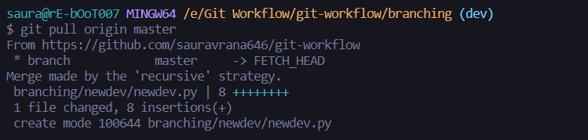

Create a Branching folder as root and inside it created a main folder in the master branch 

Now will create a dev branch and then create a dev folder along with master branch and then will make PR to merge it into the main folder of the master

Lets create a branch.

Now lets add dev folder to the branch and add some files to it.

Say another devloper is also working on the project he also created a branch and made changes and  merged them into the master.

Then I created a pull request in github and merged this code into master branch.

Now if we go back to dev branch and commit the code. Now the thing is that master is ahead of dev branch because the newdev has been merged to the master so after committing the code and before pushing this dev branch code to the remote **it is always recommended to pull before pushing.**

So after commiting do this.

Now we can push code safely and it also reduces the chances of merge conficts later on.

Now we have pushed it to github

Now we can create a pull request for this to be merged into the master too (NOTE TO SELF : not gonna create PR for this one just so that I can understand this workflow later on)